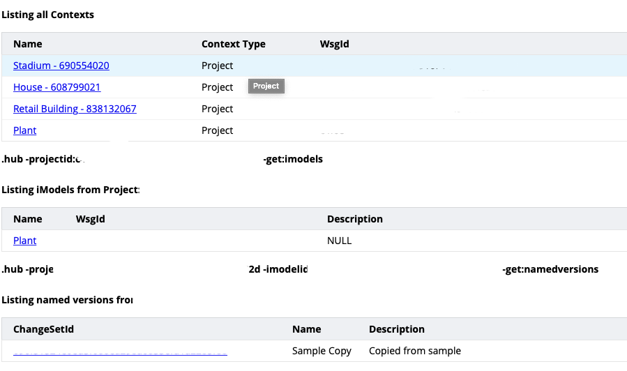

# Exploring an iModel

This section uses the [iModel Console](https://imodelconsole.bentley.com) to execute queries against the `Bay Town Process Plant` sample iModel.

## Open an iModel in the iModel Console

1. Go to `imodelconsole.bentley.com`
1. Select a project, then select an iModel then select a changeset
  
1. Wait until the green button in the lower left say Run
  

## Basic Queries

1. Query for Elements

    ```SQL
    SELECT * FROM Bis.Element
    ```

1. Count the number of elements in the iModel

    ```SQL
    SELECT COUNT(*) FROM Bis.Element
    ```

1. Show the classes which are used in the current iModel

    ```SQL
    SELECT ECClassId, COUNT(*) FROM bis.Element GROUP BY ECClassId ORDER BY COUNT(*) DESC
    ```

    > NOTE 1: GROUP BY, ORDER BY [ASC|DESC] are standard parts of the SQLite syntax

    > NOTE 2: ECClassId is stored as a 64 bit integer but are converted to a more readable format of `<SchemaName>.<ClassName>` for display.  Queries use the internal 64 bit representation which enables very efficient matching.

1. Select all ProcessPhysical Pipe elements

    ```SQL
    SELECT * FROM ProcessPhysical.PIPE
    ```

    > NOTE: There are a lot more properties shown when querying for PIPE then for bis.Element.  ECSql is polymorphic but only selects the properties defined by the FROM class.

1. Select all ElementRefersToElements relationships

    ```SQL
    SELECT * FROM Bis.ElementRefersToElements
    ```

    > NOTE 1: Every row (Element, Model, Link Table Relationship) has an ECInstanceId, this is a unique 64 bit integer for that type of instance (e.g. an ECInstanceId is unique for all Elements but there may be a Model with the same Id)

    > NOTE 2: Each Row has a SourceECInstanceId and a TargetECInstanceId, these are the Ids of the Elements on either end of the relationship.

1. Find Elements which are related to ProcessPhysical.PIPE

    ```SQL
    SELECT ere.ECClassId, s.ECClassId, t.ECClassId, COUNT(*) FROM Bis.ElementRefersToElements ere 
      JOIN bis.Element s ON s.ECInstanceId = ere.SourceECInstanceId 
      JOIN bis.Element t ON t.ECInstanceId = ere.TargetECInstanceId 
      WHERE s.ECClassId IS (ProcessPhysical.PIPE) OR t.ECClassId IS (ProcessPhysical.PIPE)
    ```

    > NOTE 1: This is an `INNER JOIN`, if you want an OUTER JOIN use `LEFT JOIN`

    > NOTE 2: This query uses the `IS` keyword to limit classes. See this tutorial on [Type Filtering](https://www.itwinjs.org/learning/ecsqltutorial/typefilter/) for more details.

1. Select weight and length of pipes

  ```SQL
  SELECT p.LineNumber, p.Length, p.Length FROM ProcessPhysical.PIPE
  ```

1. Sum up the length and weight of pipe by Line Number

    ```SQL
    SELECT p.LineNumber, SUM(p.Length) Length, SUM(p.Weight) Weight, COUNT(*) num_Pipes 
      FROM ProcessPhysical.PIPE p GROUP BY p.LineNumber
    ```

1. Add a grouping by component name

    ```SQL
    SELECT p.LineNumber, p.Component_Name, SUM(p.Length) Length, SUM(p.Weight) Weight, COUNT(*) num_Pipes 
      FROM ProcessPhysical.PIPE p GROUP BY p.LineNumber, p.Component_Name
    ```

[Next: Exploring Schemas](ExploringSchemas.md)