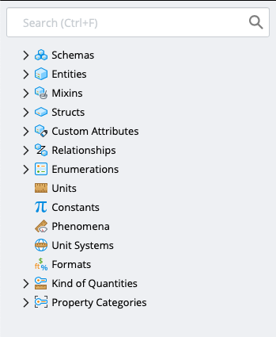
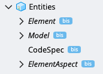
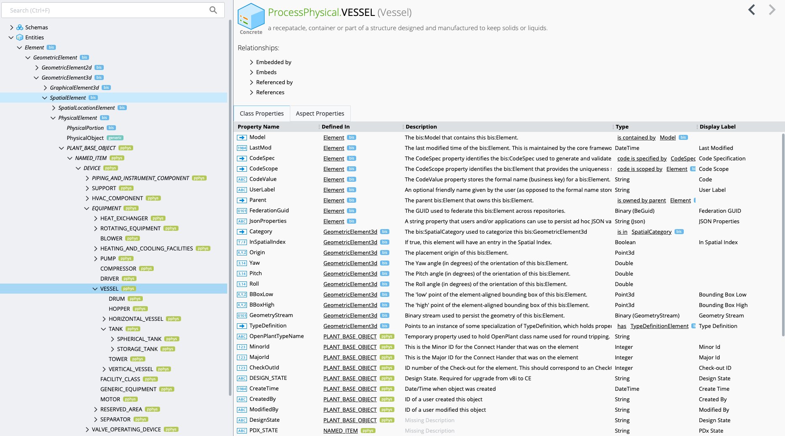
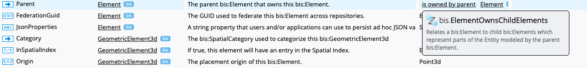
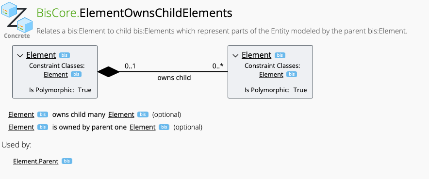
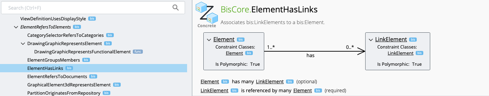
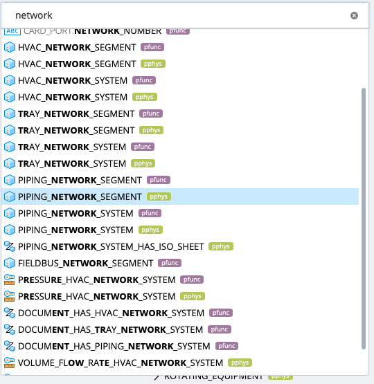

# Exploring the schemas in an iModel using the Schema Explorer

This section uses the [iModel Schema Explorer](https://imodelschemaeditor.bentley.com) to view the schemas in the `Bay Town Process Plant` sample iModel.

## Open an iModel in the iModel Schema Explorer

1. Open the iModel in the iModel Console.  See [Exploring An iModel](ExploringAniModel.md) for instructions.
1. Enter `.schema` in the command line or click on the gear in the upper right hand side and select the Schema Explorer.

> NOTE: You can view a standard set of BIS schemas by going to https://imodelschemaeditor.bentley.com at any time.

## Using The Schema Explorer

The Left hand bar provides search and can be used to browse to any schema or item of a schema

The side bar includes a top level node for every kind of item that can be defined in a schema.  See [the schema documentation](https://www.itwinjs.org/bis/ec/) for details on each schema item.

Expanding `Entities` shows the core classes discussed in [What is BIS](WhatIsBIS.md)

Expanding the nodes show derived classes and selecting a class shows the properties of that class

Take note of the `Model`, `Parent`, `Category` and `TypeDefinition` properties, they are examples of Navigation Properties discussed in [What is BIS](WhatIsBIS.md).  Hovering over the description of the relationship in the `Type` column shows a preview of the relationship and click on it takes you to that relationship.

Relationship pages describe the relationship using a UML like diagram and show the navigation property that uses it (if it is that type of relationship)

Relationship constraints differ for each relationship, here is a specilization of `ElementRefersToElements`

Don't forget to use the search bar to find what you're looking for!

