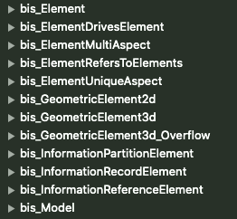
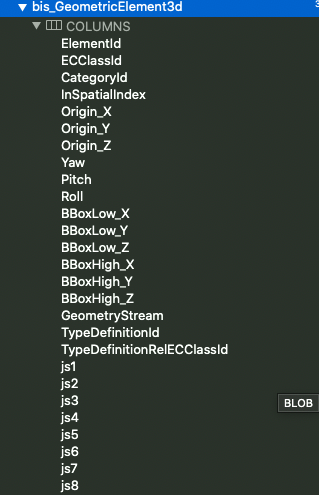
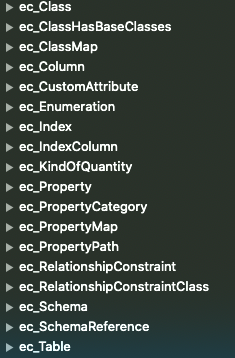

# iModel File Structure

Opening an iModel in a SQLite browser shows that it's just a normal SQLite file.  The table structure is what makes a SQLite file an iModel.  There are tables with a number of prefixes, the two most important prefixes are `bis_` and `ec_`.  

The `bis_` tables hold all elements, aspects, models and relationships stored in the iModel and can be queried using the BIS schemas.  

Some of the columns in the `bis_` tables will make sense on their own but the columns very quickly start having names like `js42` and are of type BLOB.  These columns are used to store a different property value depending on the class of each row.  This column reuse is what allows an iModel to efficiently store Elements of an arbitrary number of classes in a fixed set of tables.  It also allow efficient polymorphic queries and fast joins between related Elements.

The `ec_` tables hold the class information that map from the bis_ tables to the classes defined in the BIS schemas.  The information in these tables is used to power ECSQL and is queryable using the ECDbMeta schema.

[Next: Exploring an iModel](ExporingAniModel.md)